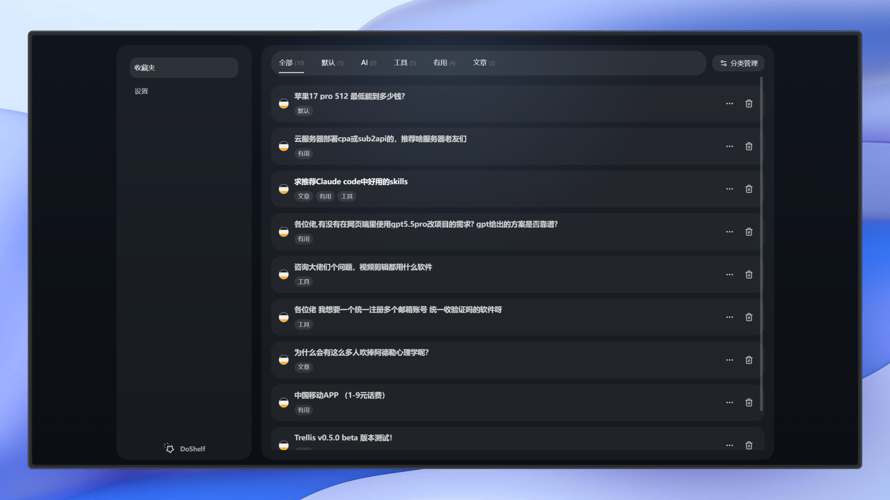
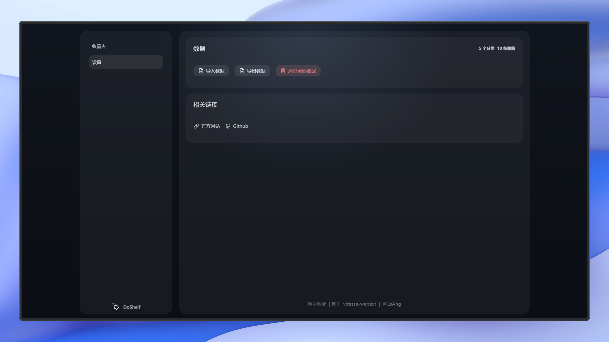
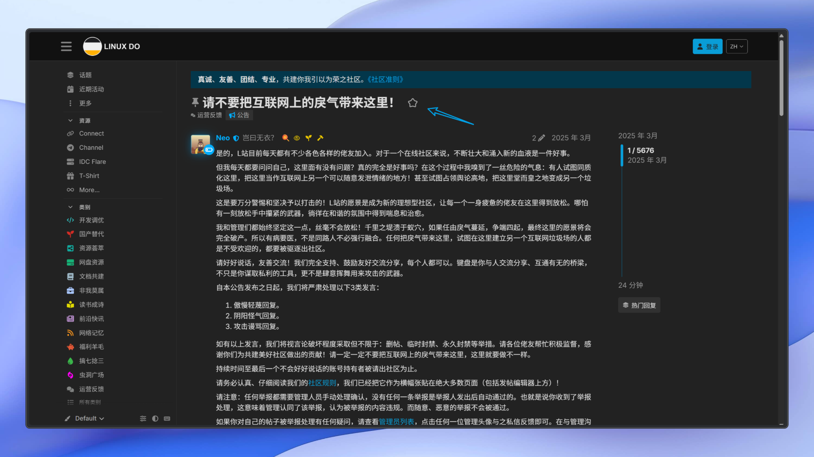
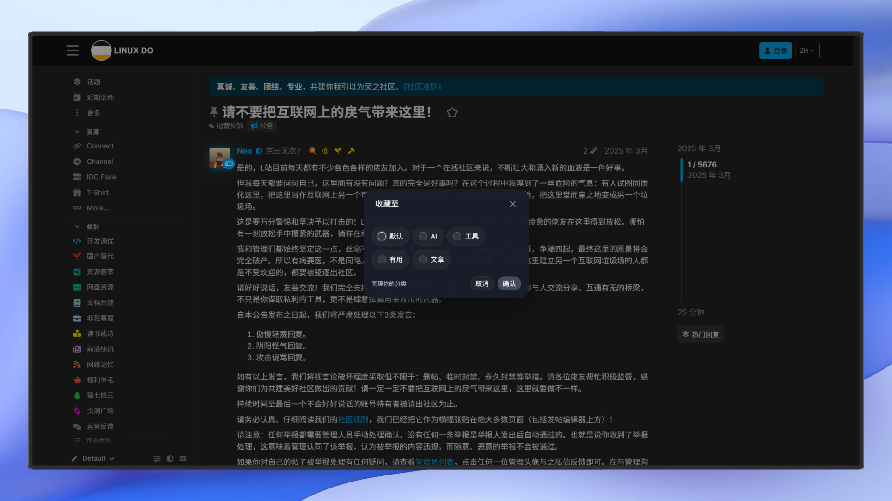

<h1 align="center">DoShelf</h1>
<p align="center">
  
</p>
<p align="center">DoShelf 是一个用于收藏管理 Linux.do 帖子的浏览器扩展，帮助你收藏整理感兴趣的帖子。</p>

## 安装

[Edge 扩展商店](https://microsoftedge.microsoft.com/addons/detail/doshelf/bmloldgelbkhglnaoghflbfdbojogfjg)

[ZIP 安装](https://doshelf.llds.cloud/install)

## 截图






## 开发

关键目录：

- `src/background/`：扩展后台脚本入口与后台逻辑。
- `src/contentScripts/`：页面内容脚本，负责与 Linux.do 页面交互。
- `src/options/`：扩展设置页。
- `src/manager/`：书架管理页面相关代码。
- `src/components/`：可复用组件。
- `src/logic/`：核心业务逻辑与数据处理。
- `src/shared/`：共享类型、存储封装和通用能力。

```bash
# 安装依赖
pnpm install

# 启动 Chrome/Chromium 开发模式
pnpm dev

# 启动 Firefox 开发模式
pnpm dev-firefox

# 构建生产版本
pnpm build

# 构建压缩包
pnpm pack:zip

# 类型检查
pnpm typecheck

# 代码格式化
pnpm format
```

## LINUX DO

[**LINUX DO 社区**](https://linux.do) (真诚 、友善 、团结 、专业)
