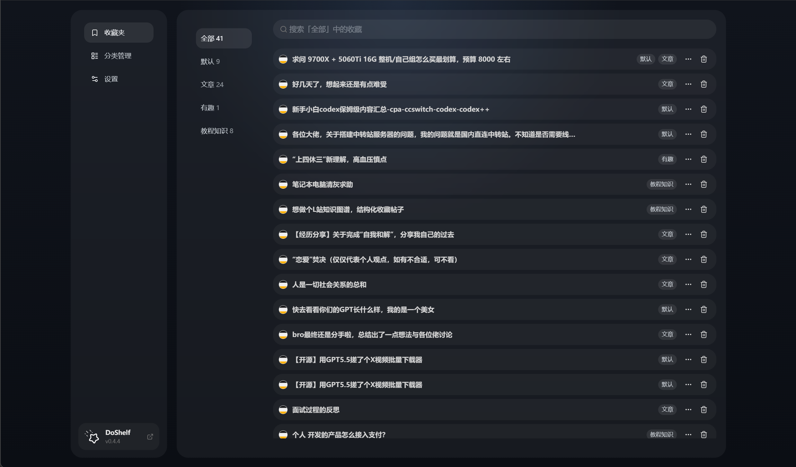
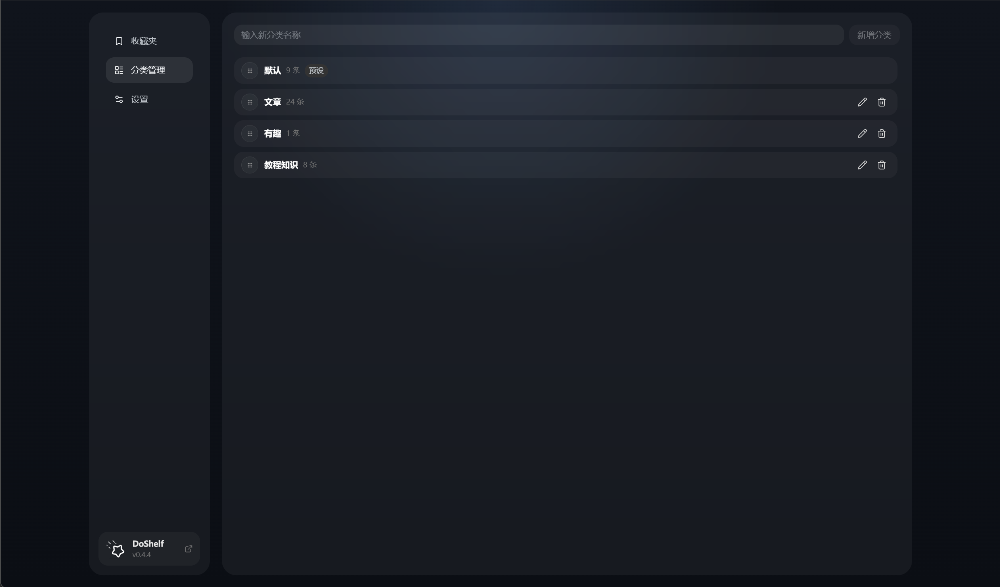
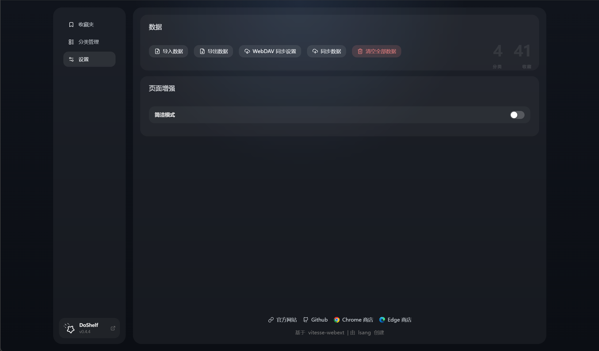
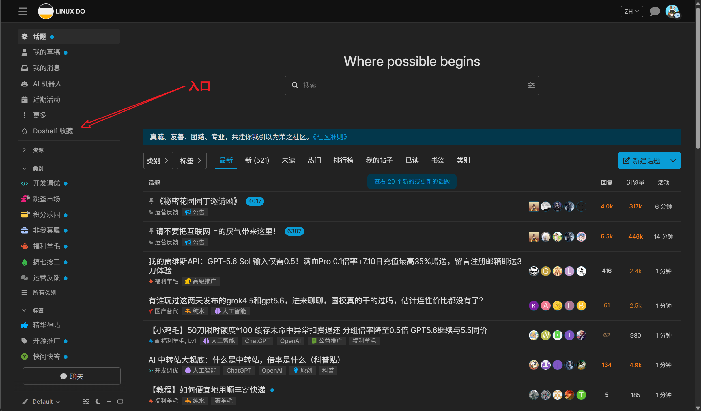
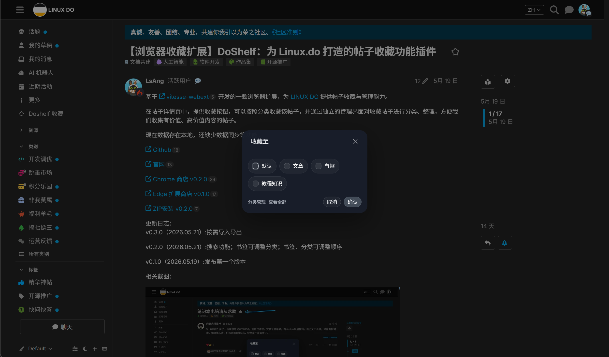

<p align="center">
  
</p>

# DoShelf

DoShelf 是一个用于收藏管理 Linux.do 帖子的浏览器扩展，帮助你收藏整理感兴趣的帖子。
[官方网站](https://doshelf.llds.cloud)

<!-- PROJECT SHIELDS -->

[![Stargazers][stars-shield]][stars-url]
[![Issues][issues-shield]][issues-url]
[![MIT License][license-shield]][license-url]

## 安装

[Chrome 商店](https://chromewebstore.google.com/detail/doshelf/cimpakecpbafknbammmnpiifekgjmbkl)

[Edge 商店](https://microsoftedge.microsoft.com/addons/detail/doshelf/bmloldgelbkhglnaoghflbfdbojogfjg)

[ZIP 安装](https://doshelf.llds.cloud/install)

## 功能

- 收藏 Linux.do 帖子
- 管理收藏帖子、分类、顺序
- 数据：导入导出、WebDAV 同步
- 额外功能：页面增强（简洁模式）

## 截图











## 开发

关键目录：

- `src/background/`：扩展后台脚本入口，负责处理扩展图标点击和管理页打开等逻辑。
- `src/contentScripts/`：Linux.do 页面内容脚本，负责收藏入口、收藏交互和页面增强。
- `src/manager/`：书架管理与设置页面，包括收藏管理、分类管理、数据导入导出和 WebDAV 同步。
- `src/shared/`：书签数据模型、存储、设置、导入导出和 WebDAV 等共享能力。
- `src/components/`：可复用组件。
- `src/composables/`：可复用的 Vue 组合式函数。
- `src/theme/`、`src/styles/`：主题配置与全局样式。

安装依赖：

```bash
pnpm install
```

Chrome/Chromium 开发时，先启动开发构建与文件监听：

```bash
pnpm dev
```

然后在另一个终端中启动浏览器：

```bash
pnpm start:chromium
```

Firefox 开发方式相同：

```bash
# 终端 1：开发构建与文件监听
pnpm dev-firefox

# 终端 2：启动 Firefox
pnpm start:firefox
```

提交代码前可执行以下检查：

```bash
pnpm typecheck
pnpm test
pnpm format:check
```

生产构建与打包：

```bash
# 先生成 extension/ 中的生产构建
pnpm build

# 再生成 ZIP、CRX 和 XPI 安装包
pnpm pack
```

## LINUX DO

[**LINUX DO 社区**](https://linux.do) (真诚 、友善 、团结 、专业)

<!-- links -->

[stars-shield]: https://img.shields.io/github/stars/llds66/do-shelf.svg?style=flat
[stars-url]: https://github.com/llds66/do-shelf/stargazers
[issues-shield]: https://img.shields.io/github/issues/llds66/do-shelf.svg?style=flat
[issues-url]: https://img.shields.io/github/issues/llds66/do-shelf.svg
[license-shield]: https://img.shields.io/github/license/llds66/do-shelf.svg?style=flat
[license-url]: https://github.com/llds66/do-shelf/blob/main/LICENSE
